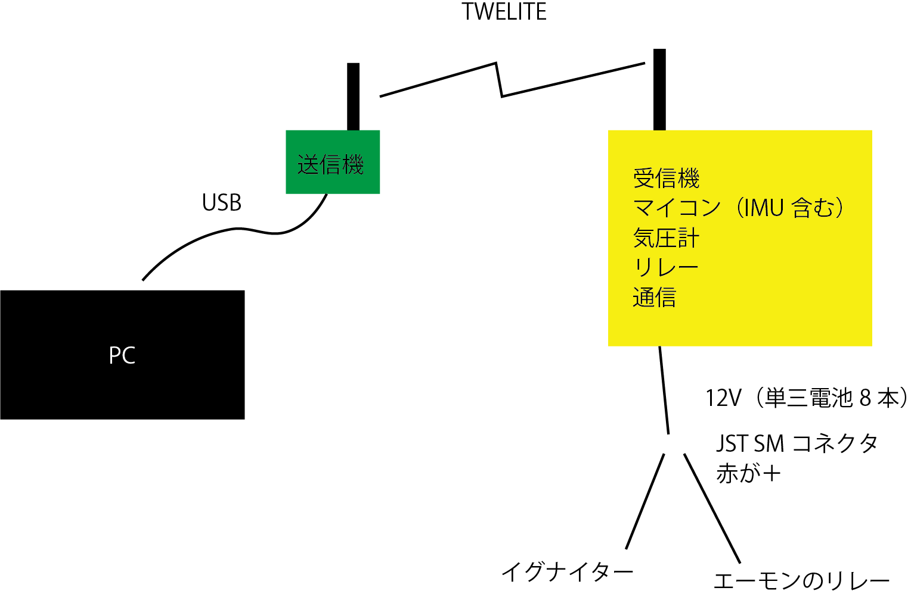
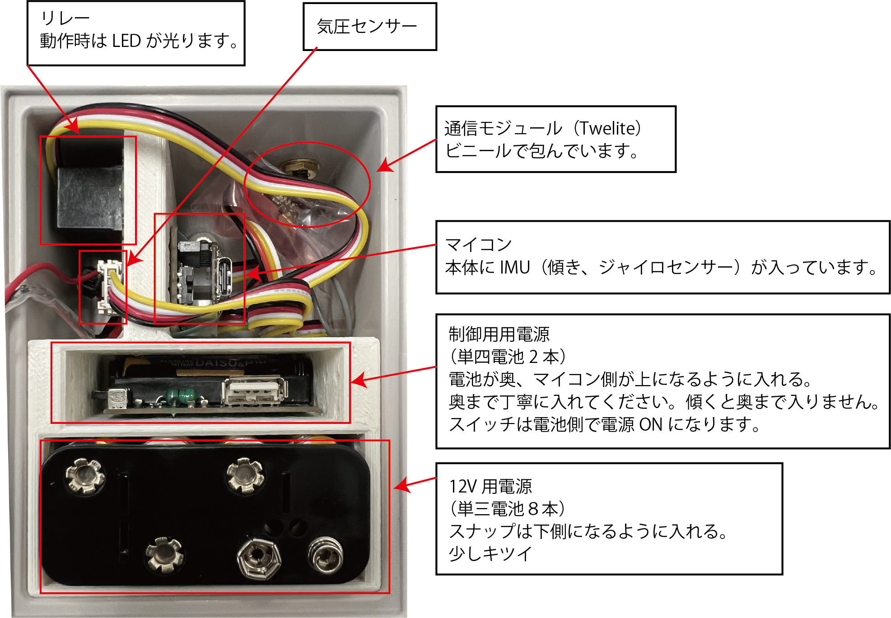

# Rocket2022
発射実験用

## 使用機材
### PC側
|物品名|規格|URL|備考|
| --- | --- | ---| --- |
|PC|Ubuntu 22.04+NodeRed+InfluxDB| |USB端子があれば|
|TWELITE|TWELITE DIP|https://mono-wireless.com/jp/products/TWE-Lite-DIP/index.html| |
|TWELITE|TWELITE R2|https://mono-wireless.com/jp/products/TWE-LITE-R/index.html| |
|SMA変換ケーブル|MW-C-UJ-10-1|https://mono-wireless.com/jp/products/TWE-ANTENNAS/cables/index.html| |
|防水可倒式アンテナ|MW-A-D114|https://mono-wireless.com/jp/products/TWE-ANTENNAS/dipole/outdoor-ant.html| |
|ケース|タカチ SW‐85B|https://akizukidenshi.com/catalog/g/gP-12472/| |

TWELITEは、普通にUART+適当な変換器(3.3V)でもよかったかも。（TWELITE Stageを設定すると、/dev/ttyUSB0 が見えなくなる。ので設定ソフトとの共用は難しい。無難に設定はWindows機を用意した方が簡単

### ロケット側
|物品名|規格|URL|備考|
| --- | --- | --- | --- |
|マイコン|Seeed Studio XIAO nRF52840 Sense|https://www.seeedstudio.com/Seeed-XIAO-BLE-Sense-nRF52840-p-5253.html|IMU入ってるし、小さいのでこれを選択。あと3.3Vなので（M5は5V)|
|マイコン拡張基板|Seeeduino Xiao用Grove|https://wiki.seeedstudio.com/Grove-Shield-for-Seeeduino-XIAO-embedded-battery-management-chip/|折って4口までにした|
|気圧計|Grove - High Precision Barometric Pressure Sensor (DPS310)|https://www.seeedstudio.com/Grove-High-Precision-Barometer-Sensor-DPS310-p-4397.html|高度が測れる精度が欲しかった|
|リレー|Grobe　Relay|https://www.seeedstudio.com/Grove-Relay.html|3.3Vで動くリレー|
|TWELITE|TWELITE UART|https://mono-wireless.com/jp/products/twelite-uart/index.html|Groveケーブルをはんだ付け|
|SMA変換ケーブル|MW-C-UJ-10-1|https://mono-wireless.com/jp/products/TWE-ANTENNAS/cables/index.html||
|防水可倒式アンテナ|MW-A-D114|https://mono-wireless.com/jp/products/TWE-ANTENNAS/dipole/outdoor-ant.html||
|マイコン用電源（昇圧回路）|電池基板A4-2Unit|https://www.switch-science.com/products/6759|マイコン動作の5Vを簡単にしたかったのでUSBでつないだ|
|発火用電池ボックス|単3x8|https://akizukidenshi.com/catalog/g/gP-00312/||
|バッテリスナップ| |https://akizukidenshi.com/catalog/g/gP-00312/||
|ケース|タカチ　BCPC091208T|https://www.takachi-el.co.jp/products/BCPC||

ねじ少々(M2、M3)

気圧がI2C（D4,D5）、リレーがGPIO（D1,D2）、TWELITEがUART（D6,D7）に接続する。

マイコンと拡張基板が結構ゆるゆるだったのでマスキングテープで補強した。

組み立て 

## 開発環境
### PC側
- Ubuntu 20.04LTS
- Node-Red
  - node-red-dashboard
  - node-red-node-serialport
  - node-red-contrib-influxdb
- InfluxDB(OSS) https://www.influxdata.com/
- 
### ロケット側
#### Arduino 1.8.19
Boardは、"Seeed nRF52 mbed enable boards --> Seeed XIAO BLE sense"を利用する。ただし、Board両方Installする必要あり。　https://wiki.seeedstudio.com/XIAO_BLE/

Libraryは以下の2つ
-   Seeed_Arduino_LSM6DS3 Library　https://github.com/Seeed-Studio/Seeed_Arduino_LSM6DS3
-   Adafruit DPS310
 

## リンク

XIAO BLE https://wiki.seeedstudio.com/XIAO_BLE/
